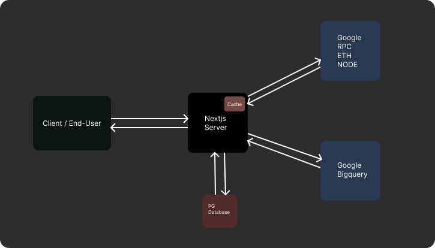

## 📌 Foreword

I didn’t want to start this project at first — I was too unsure about diving into something so unfamiliar. But as time passed, the idea stuck with me, and eventually, I felt motivated to build it out.

Active development began on March 30th, 2025. Since then, I’ve spent over 100 hours brainstorming, designing, building, and deploying this app. My goal was to build it like a real product within the limited time I had.

I’m truly thankful to the StackUp team for extending the submission deadline — without that, this project wouldn’t have been possible.

This is my first real Web3 app. I gave it everything I had.

**I genuinely hope this app serves a real need out there.**

---

## 👨‍💻 Team Members

- **Abhishek Prajapati** – Solo Developer, Designer, and Builder of PYScan
  I took full ownership of this project from ideation to deployment within the hackathon timeframe.

---

## 💡 Inspiration

This project draws inspiration from established platforms that offer deep blockchain analytics and monitoring:

- **[Etherscan](https://etherscan.io)**: The go-to resource for tracking Ethereum transactions, addresses, and tokens. Its intuitive interface and real-time data tracking have been a huge inspiration for building a comprehensive tool for PayPal USD.
- **[Nansen.ai](https://www.nansen.ai)**: Known for its cutting-edge analytics platform, Nansen leverages on-chain data to provide insights about wallet activities, token movements, and market trends. Its ability to analyze and present complex data in a digestible format has influenced the design of PYScan.

These platforms showed us the value of bringing transparency and detailed insights into the world of digital assets, which is exactly what we aim to achieve with PYScan for PayPal USD.

---

## 🧠 Project Overview

PYScan is a tailored observability and analytics tool built specifically for PayPal USD (PYUSD). It aims to bring transparency, insights, and usability to anyone dealing with PYUSD — including investors, compliance officers, and analysts.

This platform goes beyond basic charts. It provides deep analytics, real-time scanning of blocks and transactions, and comparative insights into PYUSD's growth versus competitors. Whether you're tracking balances or validating transactions, PYScan makes it effortless.

---

## 🧠 Key Decisions

While building PYScan, several key decisions were made to ensure the tool would be practical, user-friendly, and impactful. Here are some of the important decisions:

### 1. **Choice of Blockchain: Ethereum Mainnet**

Since this is my first Web3 app and I have limited experience with different blockchain ecosystems, I decided to support only the Ethereum Mainnet. The choice was motivated by my understanding of the Ethereum network and its widespread adoption. Implementing both Ethereum and Solana networks would have been challenging given my lack of prior Web3 application experience. Additionally, Ethereum's test networks like Holesky did not offer enough value compared to the mainnet, and thus, focusing solely on Ethereum Mainnet was the best option for creating a stable and impactful product. The goal was to ensure accessibility and provide valuable insights to end-users, and Ethereum Mainnet was the clear choice to achieve this.

### 2. **Real-Time Capabilities vs. Cost Optimization**

While almost all the features implemented could provide real-time data capabilities, the costs associated with continuously fetching and processing real-time data were prohibitive, given the free-tier resources I am using to run this app. To ensure a balance between performance and cost-efficiency, I have made strategic decisions to limit the real-time functionality to only the most essential and least resource-intensive features. For the more resource-demanding areas, I have implemented aggressive server-side caching to minimize the impact on performance and costs.

Importantly, this approach does not mean users are accessing static or outdated data. Instead, it ensures that the data is regularly updated and that performance is optimized without breaking the bank. Every decision here was made with a careful balance of providing valuable insights without incurring excessive costs.

### 3. **Heterogeneous Data Sources for Better Insights**

While the hackathon description emphasized the use of GCP's RPC and BigQuery services, it wasn't explicitly mentioned that these were to be used exclusively. I approached this project not just as a weekend hack, but as a foundational MVP aimed at providing real value to real users. To deliver more insightful and enriched dashboards, I decided to incorporate additional data sources beyond GCP—such as CoinMarketCap APIs for fetching market data and comparisons.

This multi-source approach allowed me to build a more comprehensive analytics experience for users who care about PayPal USD, its market performance, and how it compares to competitors. Every added source was chosen to support the core mission of observability and usability for actual users in the real world.

### 4. Proof of Concept First, Scale Later

This MVP was built primarily as a **proof of concept**, not as a production-grade scalable app. However, I did make an effort to consider scalability **wherever feasible**, without overwhelming myself during the limited hackathon window.

- The architecture and coding patterns support **future extensibility**.
- I started off with a well-organized and clean codebase, but as the deadline approached, things understandably got messier.
- I'm not proud of the state the code ended in—but I prioritized delivering value and proving the concept within time constraints.

The goal was to **focus on functionality and product thinking first**, and I believe this was the right trade-off for this stage.

---

## 📊 Data Sources

- Google RPC API
- Google BigQuery
- CoinmarketCap API

---

## 🛠️ Tech Stack

- Nextjs 15
- Typescript
- Tanstack React Table & React Query
- Tailwindcss
- HeroUi

---

## ✨ Key Features

This app covers **three major quadrants** to help users gain deep insights into the PayPal USD (PYUSD) ecosystem:

### 🧭 1. Explorer

- Track **gas trends** and **network congestion** on Ethereum Mainnet.
- Analyze **PYUSD’s market dominance** among other stablecoins.
- **Search** any address, block number, or transaction hash.
- **Inspect** a transaction by its hash.
- **Inspect** a block by block number, including all transactions in that block.
- **Stream real-time PYUSD transactions** as they happen on-chain.
- View **latest blocks** mined on Ethereum Mainnet.
- Browse **historical PYUSD transactions**.
- View **historical transactions** for a specific wallet address.
- Check **PYUSD balance** of any wallet address.
- Download Table Data: Export table data to CSV format directly from the page for easier offline analysis.
- Calendar Date Filter: Use a calendar date selector to filter transactions in the data tables based on specific timeframes.
- Efficient Pagination: Paginated terabytes of on-chain transaction data to ensure smooth and fast browsing without compromising performance.

### 📊 2. Analytics

- Visualize **token transfer volume** of PYUSD, with comparison to other stablecoins over time.
- Analyze **token transfer counts** of PYUSD vs competitors across various timeframes.
- Dive into **mint and burn trends** for PYUSD.
- Understand **market adoption** of PYUSD through holder growth metrics.
- Track **growth of new holders** and **active users** over time.
- Analyze **unique senders** and **receivers** to assess transaction diversity.
- Download Chart Data: Export chart data in CSV format for different timeframes to analyze trends offline.

### 🏆 3. Leaderboards

Discover the top players in the PYUSD ecosystem (tracked over the last 30 days):

- 🟢 **Top Senders** — wallets initiating the highest number of transfers.
- 🟣 **Top Receivers** — wallets receiving the most transactions.
- 🔥 **Top Burners** — addresses involved in burning the most PYUSD.
- 💰 **Top Holders** — addresses holding the largest PYUSD balances.

## 📸 Screenshots

---

## ⚙️ Setup & Installation

1. Clone the Repository

```bash
git clone https://github.com/bhishekprajapati/pyscan.git

```

2. Install Dependencies

```bash
cd pyscan && pnpm install
```

3. Set Up Environment Variables

```
ETHEREUM_MAINNET_JSON_RPC_URL=""
ETHEREUM_HOLESKY_JSON_RPC_URL=""
ETHEREUM_MAINNET_WSS_URL=""
ETHEREUM_HOLESKY_WSS_URL=""
COINMARKET_API_KEY=""

AUTH_SECRET="" # Added by `npx auth`. Read more: https://cli.authjs.dev
AUTH_GOOGLE_ID=""
AUTH_GOOGLE_SECRET=""
AUTH_DRIZZLE_URL=""
AUTH_DRIZZLE_BASE64_CA=""

DATABASE_URL=""

UPSTASH_REDIS_KV_URL=""
UPSTASH_REDIS_KV_REST_API_READ_ONLY_TOKEN=""
UPSTASH_REDIS_REDIS_URL=""
UPSTASH_REDIS_KV_REST_API_TOKEN=""
UPSTASH_REDIS_KV_REST_API_URL=""

# base64 encoded json key of service account
# having "BigQuery Data Viewer" and "BigQuery Job User" privileges
# cat /path/to/your/service/account/credentials.json | base64
GOOGLE_CREDS_BASE64_1=""
```

4. Run the Development Server

```bash
pnpm dev
```

5. Visit the App
   The app should now be running at `http://localhost:3000`

## **NOTE**: Some components won't show live data in developement. This is intentional to save bigquery quota while developing the app.

---

## Folder Structure

```

.
├── public/
│ └── ... public resources
├── src/
│ ├── components/
│ │ └── ... primitve and ui components
│ ├── pages/
│ │ ├── index.tsx
│ │ └── ...
│ └── utils/
│ └── ...
├── .env
├── .gitignore
├── LICENSE
├── README.md
├── package.json
├── tsconfig.json
└── ...
```

---

## 🏗️ App Architecture



---

## 🔮 Future Improvements & Potential

These additions can significantly enhance the app's capabilities—turning it into a full-fledged observability and intelligence platform for PayPal USD. They aim to expand coverage across key areas like monitoring, tracking, profiling, and compliance:

1. Integration with DeFi protocols to analyze PYUSD usage
2. Detection of MEV patterns and frontrunning behavior
3. Risk scoring and trust profiling for wallets
4. Real-time wallet activity monitoring and alerts
5. Cross-chain support for broader ecosystem visibility
6. AI-powered anomaly and fraud detection
7. In-depth profiling of wallets and address behaviors
